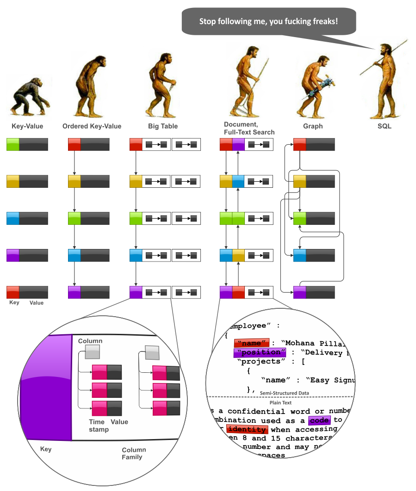

# NoSQL: Tipos

Nesta seção são apresentadas as principais características dos bancos de dados NoSQL.

## Chave-Valor

## Documento

## Família de Colunas

## Grafo

## Versionamento de Dados

## Processamento Distribuído
