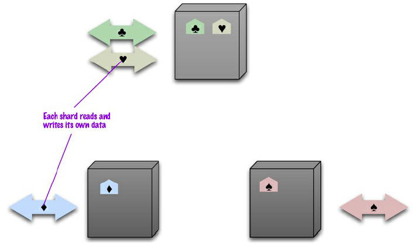
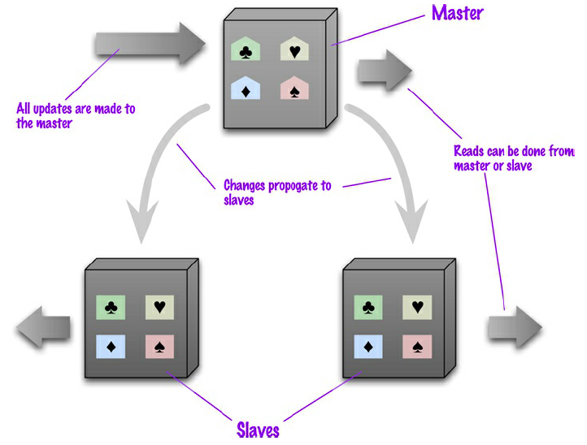
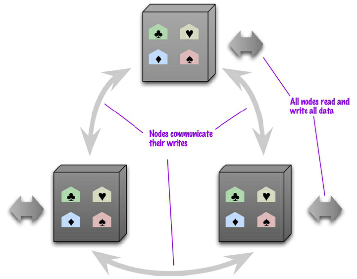
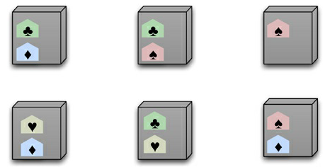

# NoSQL: Arquitetura

Nesta seção são apresentadas as principais arquiteturas para implementação de bancos de dados NoSQL utilizando *cluster* computacional para distribuição de armazenamento e processamento.

## Servidor Único (*Single Server*)

A mais simples, e tipicamente mais barata, opção de distribuição de armazenamento e processamento é a opção utilizada com maior frequência, a **não distribuição**. O banco de dados persiste em uma única máquina (servidor) que lida com todas as requisições de leitura e gravação no banco de dados. A não distribuição é muito utilizada, uma vez que elimina toda a complexidade inerente à distribuição de dados e de processamento, sendo de fácil manutenção e de fácil entendimento por parte dos desenvolvedores de aplicações.

Embora muitos bancos de dados NoSQL sejam projetados para execução em *cluster*, em algumas situações pode-se fazer sentido usar NoSQL com um modelo de distribuição de servidor único. Bancos de dados baseados em grafos tipicamente adotam essa arquitetura, uma vez que são mais eficientes em uma configuração de servidor único. Além disso, se a demanda é por um processamento simples de baixo volume de agregados, sejam eles orientados a documentos ou chave-valor, a configuração de servidor único pode tornar mais fácil a tarefa dos desenvolvedores de aplicações.

## Fragmentação (*Sharding*)

Freqüentemente, um banco de dados tem sua disponibilidade comprometida porque diferentes pessoas estão acessando simultaneamente partes diferentes do banco de dados. Nessa situação, a distribuição de partes diferentes dos dados em
servidores diferentes, uma técnica denominada fragmentação, faz todo sentido para oferecer suporte à escalabilidade horizontal. Assim, o volume de requisições e processamento é distribuído entre os nós, diminuindo a pressão por processamento em um único nó específico.

A fragmentação é particularmente eficiente para operações de escrita no banco de dados, uma vez que os dados são fragmentados e escritos paralelamente em nós diferentes. Entretanto a fragmentação pouco contribui para a resiliência (capacidade de tolerância a falhas) do sistema, uma vez que parte dos dados ficará indisponível caso o nó que armazene os dados se torne indisponível.

## Replicação Mestre-Escravo (*Master-Slave*)

A replicação de dados oferece resiliência, uma vez que os dados são replicados entre múltiplos nós e a indisponibilidade de um deles não compromete a disponibilidade geral do sistema. Numa replicação mestre-escravo, um nó é designado como mestre, ou primário, e os outros são designados como escravos, ou secundários, cabendo ao nó mestre a autoridade sobre os dados, processando todas as requisições de atualização.

Como pode-se observar na figura acima, a replicação mestre-escravo é extremamente efetiva para escalabilidade em bancos de dados de leitura intensiva, oferecendo resiliência de leitura, mas sendo menos efetiva em casos de escrita intensiva, pelo fato da escrita ser de responsabilidade exclusiva do nó mestre.

## Replicação Ponto-a-Ponto (*Peer-to-Peer*)

A replicação mestre-escravo é útil para escalabilidade de leitura, mas pouco útil para escalabilidade de escrita, provendo resiliência em caso de falhas de nós escravos, mas nenhuma resiliência em caso de falha do nó mestre. Numa replicação ponto-a-ponto todos os nós tem autoridade sobre seus dados processando tanto requisições de leitura quanto de escrita.

Do ponto de vista de resiliência, essa configuração apresenta desempenho excelente, mas o grande desafio é manter a consistência. Ao se escrever em dois lugares diferentes, corre-se o risco de que duas pessoas tentem atualizar o mesmo registro ao mesmo tempo, um conflito escrita-escrita. Inconsistências na leitura levam a problemas, mas pelo menos são relativamente transitórios. As escritas inconsistentes duram para sempre. Para solucionar tais problemas de consistência a replicação ponto-a-ponto utiliza técnicas de controle de versionamento de dados mais complexas, tornando o processamento de dados menos eficiente.

## Fragmentação + Replicação

Para obtenção do balanceamento entre resiliência oferecida pela replicação e eficiência oferecida pela fragmentação uma escolha óbvia é a combinação dessas duas arquiteturas em uma arquitetura híbrida.
Enquanto a combinação de fragmentação e replicação ponto-a-ponto são muito comuns em bancos de dados NoSQL orientados por colunas, a combinação de fragmentação e replicação mestre-escravo é mais comum em bancos de dados NoSQL orientados por documentos ou chave-valor.

# Refer&ecirc;ncias

\[[1][1]\] Pramod J. Sadalage, Martin Fowler. NoSQL Distilled: A Brief Guide to the Emerging World of Polyglot Persistence. 1ed. Pearson, 2013.

\[[2][2]\] Martin Fowler. Introduction to NoSQL: Definition of NoSQL, 2012.

[1]: https://doi.org/10.5555/2381014
[2]: https://www.youtube.com/watch?v=qI_g07C_Q5I&t=471s
