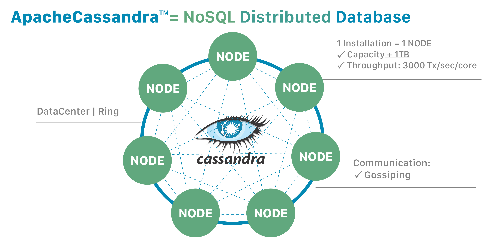

# NoSQL: Cassandra

[Apache Cassandra](https://cassandra.apache.org) é um sistema de banco de dados NoSQL **orientado a colunas** que provê uma solução de armazenamento de dados distribuída resiliente e de alto desempenho, privilegiando os aspectos de disponibilidade e tolerância de partição (ver [Teorema CAP](https://en.wikipedia.org/wiki/CAP_theorem)).

Por "distribuída" entende-se que a solução Cassandra pode ser executada em várias máquinas, mesmo que aparentemente se apresentando para os usuários como um todo unificado. Os nós comunicam-se por meio do protocolo [gossip](https://en.wikipedia.org/wiki/Gossip_protocol) \[[2](#Demers-1987-PODC)\] numa arquitetura ponto-a-ponto, conferindo à solução robustez e resiliência. Vários nós podem ser organizados logicamente em um "anel" (*ring*), sendo possível a configuração de vários *datacenters* diferentes.

Por ser baseado em nós, o Cassandra oferece escalabilidade horizontal linear (*scale-up* e *scale-down*) usando computadores de baixo custo. Para dobrar a capacidade de armazenamento ou a taxa de transferência de dados basta dobrar o número de nós. Cassandra também oferece fragmentação por particionamento hash, ou seja, os dados são segmentados em múltiplos nós a partir do uso de uma [função hash](https://en.wikipedia.org/wiki/Hash_function) para a escolha do nó que receberá o dado. Tal recurso de particionamento oferece robustez e eficiência computacional em operações de leitura e escrita de dados.

Além disso, Cassandra também oferece resiliência por replicação, ou seja, uma parte dos dados pode ser replicada para vários nós, garantindo confiabilidade e tolerância a falhas. O Cassandra suporta a noção de fator de replicação, do inglês *replication factor* (RF), que especifica quantas cópias de dados devem ser efetuadas. Por exemplo, um RF = 2 garante que uma réplica dos dados sejam armazenados em um segundo nó.

Formalmente Cassandra privilegia disponibilidade e tolerância de partição (AP - *Availability and Partition Tolerance*), mas o nível de consistência pode ser especificado por requisição de consulta. Particularmente, o nível de consistência representa o número mínimo de nós que devem reconhecer ou confirmar uma operação de leitura ou escrita antes que a operação seja considerada bem sucedida. Tipicamente, o nível de consistência corresponde ao fator de replicação.

# Refer&ecirc;ncias

\[[1][1]\] Pramod J. Sadalage, Martin Fowler. NoSQL Distilled: A Brief Guide to the Emerging World of Polyglot Persistence. 1ed. Pearson, 2013.

\[[2][2]\] Alan Demers, Dan Greene, Carl Hauser, Wes Irish, John Larson, Scott Shenker, Howard Sturgis, Dan Swinehart, Doug Terry. Epidemic Algorithms for Replicated Database Maintenance. Proceedings of the Sixth Annual ACM Symposium on Principles of Distributed (PODC), 1987.

\[[3][3]\] Martin Fowler. Introduction to NoSQL: Column-family data model, 2012.

[1]: https://doi.org/10.5555/2381014
[2]: https://doi.org/10.1145%2F41840.41841
[3]: https://www.youtube.com/watch?v=qI_g07C_Q5I&t=1056s
