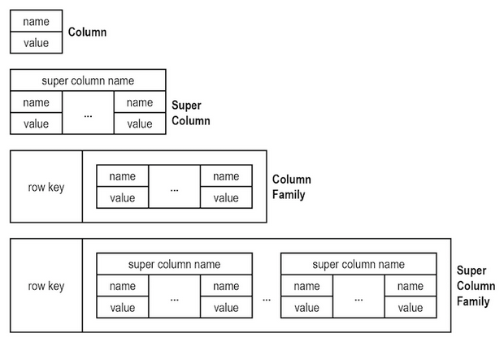

# NoSQL: Modelo de Coluna

Pode-se considerar o modelo de dados orientado a coluna, ou simplesmente modelo de coluna, como uma especialização do modelo de dados chave-valor, uma vez que ambos provêm uma estrutura composta por pares chave-valor, entretanto no modelo de dados orientado a coluna o valor armazenado consiste em uma estrutura específica denominada família de coluna (*column-family*). Particularmente o modelo de dados orientado a coluna permite o armazenamento de dados como um conjunto de pares de chave-valor, em que uma chave (*row-key*) funciona como um identificador exclusivo, e uma família de coluna (*column-family*) é um agregado de colunas, cada uma composta por um par atributo-valor.

Assim como os bancos de dados NoSQL chave-valor, os bancos dados NoSQL baseados em coluna são altamente particionáveis e permitem escalabilidade horizontal que outros tipos de bancos de dados não conseguem alcançar. Além disso, o modelo de dados orientado a coluna oferece flexibilidade na organização de dados, bem como pode ser implementado de forma muito eficiente com [funções hash](https://en.wikipedia.org/wiki/Hash_function). Tais características fazem com que os bancos de dados NoSQL baseados nesse modelo de dados ofereçam baixa latência, sendo muito efetivos para armazenamento de dados complexos e de natureza permanente (alta persistência), como no caso de armazenamento de registros de [*log* de eventos](https://en.wikipedia.org/wiki/Tracing_(software)#Event_logging), de contadores e marcadores de páginas em plataforma de [blog](https://en.wikipedia.org/wiki/Blog) e de [Sistemas de Gestão de Conteúdo (CMS - Content Management System)](https://en.wikipedia.org/wiki/Content_management_system) e de catálogos de relatórios e produtos em sistemas analíticos (vide [*Google Analytics*](https://en.wikipedia.org/wiki/Google_Analytics)) e de comércio eletrônico.

# Refer&ecirc;ncias

\[[1][1]\] Pramod J. Sadalage, Martin Fowler. NoSQL Distilled: A Brief Guide to the Emerging World of Polyglot Persistence. 1ed. Pearson, 2013.

\[[2][2]\] Martin Fowler. Introduction to NoSQL: Column-family data model, 2012.

[1]: https://doi.org/10.5555/2381014
[2]: https://www.youtube.com/watch?v=qI_g07C_Q5I&t=1056s
