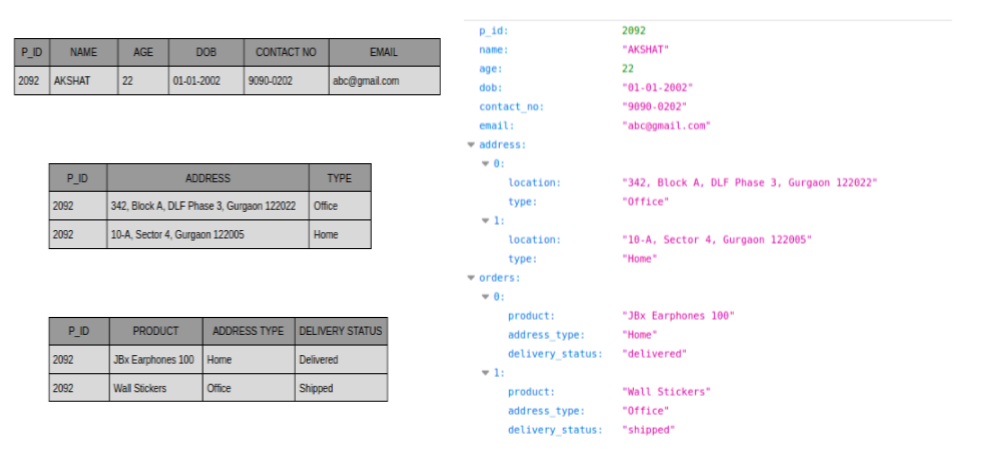

# NoSQL: Modelo Documental

Bancos de dados NoSQL baseados em documento (*document*) usam um modelo de dados baseado numa estrutura complexa composta por uma hierarquia de documentos semiestruturados para organização dos dados no banco de dados. Particularmente o modelo documental (ou orientado a documento) permite o armazenamento de documentos em diferentes formatos, como [XML](https://en.wikipedia.org/wiki/XML) ou [JSON](https://en.wikipedia.org/wiki/JSON), de forma flexível deixando que os documentos evoluam livremente e independentemente uns dos outros conforme a necessidade da aplicação, podendo armazenar dados como mapas, coleções e valores escalares.

A figura acima ilustra o modelo de dados documental usado para armazenar pedidos de compra em um sistema de comércio eletrônico. Como pode ser observado na figura, o documento semiestruturado à direita armazena uma coleção hierarquizada de valores de atributos correspondente a um pedido de compra. À esquerda observa-se o mesmo conjunto de dados sendo organizado usando um modelo relacional (tabular).

O modelo de dados documental oferece flexibilidade na organização de dados de natureza semiestruturada e pode ser implementado de forma muito eficiente, utilizando [estruturas hierárquicas de árvore](https://en.wikipedia.org/wiki/Tree_(data_structure)). Tais características fazem com que os bancos de dados NoSQL baseados nesse modelo de dados sejam muito efetivos para armazenamento de dados (agregados) complexos e de natureza permanente (alta persistência), como no caso de catálogos de itens e de páginas em [Sistemas de Gerenciamento de Conteúdo (*CMS - Content Management Systems*)](https://en.wikipedia.org/wiki/Content_management_system).

# Refer&ecirc;ncias

\[[1][1]\] Pramod J. Sadalage, Martin Fowler. NoSQL Distilled: A Brief Guide to the Emerging World of Polyglot Persistence. 1ed. Pearson, 2013.

\[[2][2]\] Martin Fowler. Introduction to NoSQL: Document data model, 2012.

[1]: https://doi.org/10.5555/2381014
[2]: https://www.youtube.com/watch?v=qI_g07C_Q5I&t=637s
