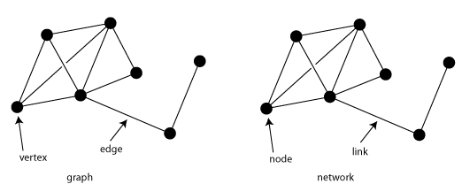

# NoSQL: Modelo de Grafo

Bancos de dados NoSQL baseados em grafo (*graph*) usam um modelo de dados baseado numa estrutura complexa composta por vértices (ou nós) e arestas (ou ligações) que ligam os vértices. Particularmente, o modelo de grafo (ou orientado a grafo) permite o armazenamento de relações complexas entre dados sob a forma de um [grafo](https://en.wikipedia.org/wiki/Graph_(discrete_mathematics)), facilitando o armazenamento e navegação por dados e relacionamentos complexos. Nessa estrutura, uma aresta está sempre relacionada a um vértice inicial e um vértice final e possui um tipo e um direcionamento, o que possibilita a descrição de relacionamentos entre pais e filhos, entre ações, propriedades e assim por diante. A quantidade e os tipos de relacionamentos que um vértice pode apresentar são ilimitados.

Diferentemente de outros modelos de dados, que estabelecem vínculos entre os dados no momento da consulta, no modelo de dados orientado a grafo os vínculos entre os dados são prestabelecidos e persistentes, o que faz com que a busca por relacionamentos entre os dados seja muito efetiva. Por exemplo, considerando o grafo apresentado na figura abaixo, a busca por todos os relacionamentos de amizade existentes entre empregados de alguma empresa é muito efetiva e envolve a simples identificação de arestas do tipo *friend* e *employer* no grafo, ao passo que em um modelo relacional tal busca tipicamente requereria a varredura e junção de múltiplas tabelas.

A figura acima ilustra o modelo de dados orientado a grafo usado para armazenar relacionamentos entre empresas, pessoas, obras literárias e categorias de conhecimento. Em particular, observa-se que as pessoas *martin* (vértice) e *pramod* (vértice) são mutuamente amigas, uma vez que possuem uma aresta *friend* bidirecional entre elas, e também são coautoras da obra literária *NoSQL Distilled* (vértice), uma vez que cada uma possui uma aresta *author* unidirecional que as ligam com a obra. Observa-se também que a obra literária *NoSQL Distilled* (vértice) pertence à categoria  *Databases* (vértice), uma vez que a obra e a categoria possuem uma aresta *category* unidirecional entre si.

O modelo de dados orientado a grafo oferece flexibilidade na organização de dados de natureza relacional complexa e pode ser implementado de forma muito eficiente, utilizando estruturas de dados específicas para representação de grafos, como [lista e matriz de adjacência](https://en.wikipedia.org/wiki/Graph_(abstract_data_type)). Tais características fazem com que os bancos de dados NoSQL baseados nesse modelo de dados sejam muito efetivos para armazenamento de dados relacionais (agregados) complexos e de natureza permanente (alta persistência), como no caso de [redes sociais](https://en.wikipedia.org/wiki/Social_networking_service), mecanismos de [recomendação](https://en.wikipedia.org/wiki/Recommender_system) e [detecção de fraudes](https://en.wikipedia.org/wiki/Data_analysis_techniques_for_fraud_detection), em que é necessário criar relacionamentos duradouros entre os dados e consultar rapidamente tais relacionamentos.

# Refer&ecirc;ncias

\[[1][1]\] Pramod J. Sadalage, Martin Fowler. NoSQL Distilled: A Brief Guide to the Emerging World of Polyglot Persistence. 1ed. Pearson, 2013.

\[[2][2]\] Martin Fowler. Introduction to NoSQL: Graph data model, 2012.

[1]: https://doi.org/10.5555/2381014
[2]: https://www.youtube.com/watch?v=qI_g07C_Q5I&t=1220s
