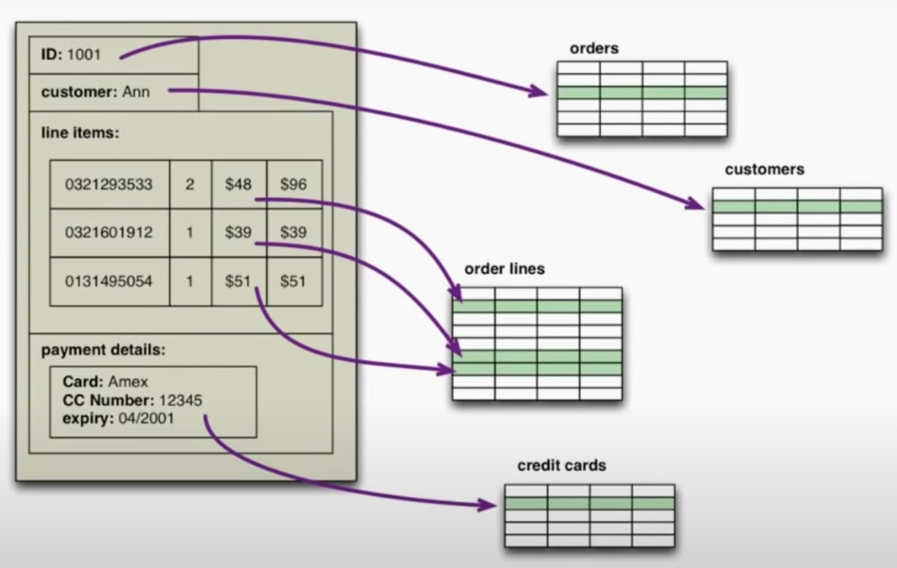
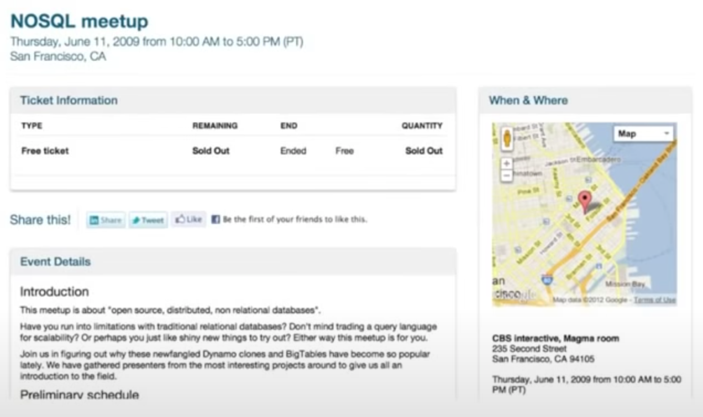

# NoSQL: História

Nesta seção são apresentados aspectos históricos relacionados ao tópico de bancos de dados NoSQL, incluindo um breve resumo sobre bancos de dados relacionais, bem como os motivos pelos quais estes vêm sendo continuamente substituídos por bancos de dados NoSQL.

## Banco de Dados Relacional

Desde a década de 1980 os bancos de dados relacionais dominaram a escolha de arquitetos de dados como a opção mais viável e confiável para armazenamento de dados, especialmente para aplicações corporativas. O valor mais óbvio para justificar esta escolha é a capacidade dos bancos de dados relacionais de armazenarem grandes quantidades de dados de forma persistente, gerenciando de forma eficiente o armazenamento e transferência de dados entre memórias primárias e secundárias em uma hierarquia de memória presente nas arquiteturas computacionais modernas. Eles provêm mais flexibilidade que um sistema de arquivos para armazenar grande quantidade de dados, permitindo que usuários e aplicações obtenham pequenas porções de dados por vez de maneira fácil e rápida.

Além da **persistência**, uma outra característica marcante nos bancos de dados relacionais é sua capacidade de **controlar concorrência** entre transações executadas simultâneamente. Aplicativos corporativos frequentemente permitem múltiplos usuários trabalhando simultaneamente, e nesse contexto há muita chance de tentativas de manipulação simultânea acontecerem. Os bancos de dados relacionais ajudam a lidar com problemas de concorrência controlando todo o acesso aos seus dados por meio de transações. Embora isso não seja uma solução para tudo, uma vez que ainda é necessário lidar com erros transacionais, o mecanismo transacional é efetivo para conter a complexidade da simultaneidade.

A capacidade de **integração de dados** e de **controle de redundância** também são características marcantes dos bancos de dados relacionais que ajudam a explicar sua popularidade. Múltiplas aplicações e usuários compartilham um único conjunto de dados centralizado e não redundante, garantindo que alterações feitas por uma aplicação ou usuário sejam visíveis imediatamente por todas as outras. Mas talvez a principal característica que tenha tornado os bancos de dados relacionais tão populares tenha sido a adoção do **modelo relacional**, um modelo de dados padrão que organiza os dados de forma tabular e que propicia o uso de linguagens de consultas com uma sintaxe simples e bem definida, como a linguagem de consulta estruturada, ou SQL.

## Impedância e Escalabilidade

Apesar de todas essas características marcantes, o problema da **impedância** permanece. A organização tabular proveniente do modelo relacional traz simplicidade e elegância para a organização e recuperação de dados, mas impõe limitações quanto ao desempenho, comparado aos bancos de dados em memória, e considerando o formato dos dados recuperados, ou seja, tuplas simples sem a possibilidade de retornar estruturas complexas como listas ou registros aninhados. Tal problema tentou ser contornado a partir do uso de abordagens para mapeamento de dados relacionais para dados orientados a objeto, mas o problema persistiu.

Adicionalmente ao problema de impedância, recentemente, e especialmente com o advindo da Web, o volume de dados se tornou massivo, demandando uma **escalabilidade** na arquitetura de processamento de dados sem precedentes. Aumentar a escala implica em máquinas com maior capacidade de processamento e de armazenamento em disco e memória. Mas escalar o processamento nessas máquinas fica cada vez mais caro, além de existirem limites reais para processamento usando uma única máquina. Uma alternativa viável é usar várias máquinas com capacidade limitada de processamento em uma arquitetura de *cluster*. Um *cluster* de "pequenas" máquinas pode usar hardware comum, o que acaba tornando mais barato o tratamento do problema de escalabilidade. Essa arquitetura de *cluster* é também mais resiliente, uma vez que falhas de máquinas individuais são comuns, enquanto o *cluster* pode ser configurado para manter o processamento mesmo em caso de falhas individuais, fornecendo alta
**confiabilidade**.

Apesar de muitos esforços dos fabricantes de sistemas gerenciadores de bancos de dados relacionais, tais sistemas não foram projetados para executar em *cluster*, o que demandaria mudanças drásticas na arquitetura para permitir fragmentação de dados (*sharding*) com relaxamento de regras de integridade referencial e controle de consistência. Além disso, a política de licenciamento de bancos de dados relacionais em *cluster* geralmente torna essa opção custosa e inviável.

Recentemente, muito impulsionada por empresas de alta tecnologia como Amazon, Facebook e Google, que demandavam processamento de volumes massivos de dados em larga escala, diversas soluções de armazenamento de dados em *cluster* foram propostas, tais como *BigTable*, *Dynamo* e *HBase*. Ambas oferecem uma solução para armazenamento de volume massivo de dados dados com baixa impedância e alta escalabilidade.

## NoSQL

O termo NoSQL apareceu pela primeira vez na literatura nomeando um banco de dados relacional de código aberto que não utilizava SQL como linguagem de consulta. O uso do termo NoSQL como conhecido hoje remonta ao nome de um evento, na verdade da *hashtag* usada para marcar o evento em redes sociais, organizado em 2009 para discutir o surgimento de novas soluções de código aberto não relacionais para armazenamento de dados distribuídos em *cluster*, denominado *NoSQL Meetup*.

Não há uma definição precisa do que seja um banco de dados NoSQL, mas atualmente considera-se banco de dados NoSQL as soluções não relacionais para armazenamento persistente de volumes massivos de dados, muitas guardando algumas características comuns, como operação em *cluster* sem um esquema de dados predefinido.

# Refer&ecirc;ncias

\[[1][1]\] Pramod J. Sadalage, Martin Fowler. NoSQL Distilled: A Brief Guide to the Emerging World of Polyglot Persistence. 1ed. Pearson, 2013.

\[[2][2]\] Martin Fowler. Introduction to NoSQL: History of NoSQL databases, 2012.

[1]: https://doi.org/10.5555/2381014
[2]: https://www.youtube.com/watch?v=qI_g07C_Q5I&t=42s
