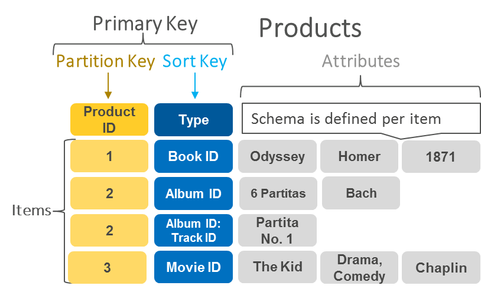

# NoSQL: Modelo Chave-Valor

Bancos de dados NoSQL chave-valor (*key-value*) usam um modelo de dados baseado numa estrutura simples composta por um campo chave e um campo valor associado à chave para organização dos dados no banco de dados. Particularmente o modelo chave-valor permite o armazenamento de dados como um conjunto de pares chave-valor, em que uma chave funciona como um identificador exclusivo, sendo que tanto a chave quanto os valores podem ser especificados como qualquer tipo de dados, desde objetos simples de domínio numérico até objetos compostos complexos, como atributos binários ([*blob*](https://en.wikipedia.org/wiki/Binary_large_object)).

Bancos de dados NoSQL chave-valor são altamente particionáveis e permitem escalabilidade horizontal que outros tipos de bancos de dados não conseguem alcançar. Muitos deles permitem a alocação de partições adicionais a um conjunto de pares chave-valor se uma partição existente for preenchida até o limite de capacidade e mais espaço de armazenamento for necessário. Dessa forma, em alguns casos é possível que o modelo chave-valor admita a composição de mais de um atributo em uma chave, por exemplo um usado para particionamento de dados e outro usado para busca de dados nas partições.

A figura acima ilustra o modelo de dados chave-valor adotado pelo sistema de banco de dados NoSQL [DynamoDB](http://aws.amazon.com/dynamodb). Como pode ser observado na figura, o atributo *Product ID* é uma chave usada para particionar os dados, o atributo *Type* é uma chave usada para busca e os valores (atributos) associados a cada chave são diferentes para cada instância de dados, evidenciando a característica de liberdade de esquema de dados.

O modelo de dados chave-valor oferece simplicidade e flexibilidade na organização de dados, bem como pode ser implementado de forma muito eficiente, utilizando por exemplo [funções hash](https://en.wikipedia.org/wiki/Hash_function) em memória (*in-memory hash*). Tais características fazem com que os bancos de dados NoSQL baseados nesse modelo de dados ofereçam baixa latência, sendo muito efetivos para armazenamento de dados simples e de natureza transitória (baixa persistência), como no caso de [cache](https://en.wikipedia.org/wiki/Cache_(computing)) de aplicação, armazenamento de sessões de usuário em aplicativos orientados por sessão ou mesmo para armazenar o carrinho de compras de usuários em *sites* de comércio eletrônico.

# Refer&ecirc;ncias

\[[1][1]\] Pramod J. Sadalage, Martin Fowler. NoSQL Distilled: A Brief Guide to the Emerging World of Polyglot Persistence. 1ed. Pearson, 2013.

\[[2][2]\] Martin Fowler. Introduction to NoSQL: Key-value data model, 2012.

[1]: https://doi.org/10.5555/2381014
[2]: https://www.youtube.com/watch?v=qI_g07C_Q5I&t=604s
