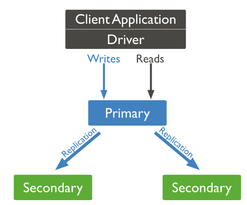
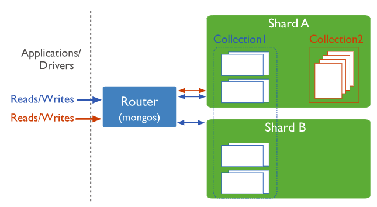

# NoSQL: MongoDB

[MongoDB](https://www.mongodb.com) é um sistema de banco de dados NoSQL **orientado a documentos** que, em sua versão paga (*Enterprise*), provê uma solução de armazenamento de dados distribuída, resiliente e de alto desempenho, privilegiando os aspectos de disponibilidade (*A - Availability*) e tolerância de partição (*P - Partition Tolerance*), tal como descritos no [Teorema CAP](https://en.wikipedia.org/wiki/CAP_theorem).

Os nós MongoDB encontram-se configurados numa [arquitetura](https://docs.mongodb.com/manual/replication/) mestre-escravo, em que requisições de escrita são processadas por um nó primário (mestre) e requisições de leitura podem ser processadas tanto pelo nó primário, quanto por nós secundários (escravos contendo réplicas dos dados), o que confere à solução alto desempenho, especialmente para leitura de dados, e tolerância a falhas derivada do mecanismo de replicação.

O recurso de replicação assíncrona presente no MongoDB aliado ao recurso de fragmentação de dados para escalonamento horizontal torna esta solução ainda mais eficiente, provendo baixa latência e alto desempenho. Um diferencial importante no mecanismo de fragmentação utilizado pelo MongoDB é que o particionamento de dados entre nós não é determinado por funções hash, mas por [*shard keys*](https://docs.mongodb.com/manual/core/sharding-shard-key/), ou conjuntos contínuos (*chunks*) de atributos indexados. Tal mecanismo de particionamento torna ainda mais efetiva a recuperação de dados.

A solução MongoDB também implementa o conceito de [transação](https://docs.mongodb.com/manual/core/transactions/) que possibilita a execução de um grupo de operações de leitura e escrita sobre diversos documentos diferentes como um único bloco lógico de execução, obviamente demandando mecanismos de controle de concorrência. Além disso, MongoDB suporta diferentes mecanismos de armazenamento (*in-memory* e *in-disk*), garantindo diferentes níveis de latência e persistência.

# Refer&ecirc;ncias

\[[1][1]\] Pramod J. Sadalage, Martin Fowler. NoSQL Distilled: A Brief Guide to the Emerging World of Polyglot Persistence. 1ed. Pearson, 2013.

\[[2][2]\] Martin Fowler. Introduction to NoSQL: Document data model, 2012.

[1]: https://doi.org/10.5555/2381014
[2]: https://www.youtube.com/watch?v=qI_g07C_Q5I&t=637s
