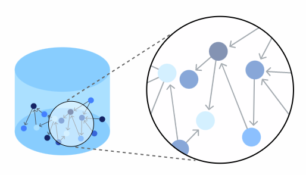

# NoSQL: Neo4J

[Neo4J](https://neo4j.com/) é um sistema de banco de dados NoSQL **orientado a grafo** que provê uma solução nativa para armazenamento de dados compatível com as [propriedades ACID](https://en.wikipedia.org/wiki/ACID) e de alto desempenho, privilegiando os aspectos de consistência (*C - Consistency*) e disponibilidade (*A - Availability*), tal como descritos no [Teorema CAP](https://en.wikipedia.org/wiki/CAP_theorem). A solução Neo4J é dita nativa por armazenar os dados sob a forma de [grafos](https://en.wikipedia.org/wiki/Graph_(discrete_mathematics)), conjuntos de vértices e arestas capazes de representar diferentes tipos de relacionamentos, simples ou complexos. Conforme descrito [neste video](https://youtu.be/urO5FyP9PoI), tal característica confere a essa solução alto desempenho na recuperação de relacionamentos entre diferentes tipos de dados.

Neo4J oferece recursos de replicação e fragmentação em que os nós podem ser configurados em uma arquitetura mestre-escravo, onde nós primários (mestres) processam requisições de leitura e escrita, enquanto nós secundários (escravos) processam exclusivamente requisições de leitura. Essa característica confere à solução Neo4J escalabilidade horizontal, alto desempenho e tolerância a falhas.

Os recursos supra descritos, bem como uma infinidade de outros recursos disponíveis na solução Neo4J, fazem dela uma solução efetiva para, dentre outros,  [sistemas de recomendação em tempo real](https://neo4j.com/use-cases/real-time-recommendation-engine/), [mecanismos de detecção de fraude](https://neo4j.com/use-cases/fraud-detection/) e [sistemas de identificação e controle de acesso](https://neo4j.com/use-cases/identity-and-access-management/).

# Refer&ecirc;ncias

\[[1][1]\] Pramod J. Sadalage, Martin Fowler. NoSQL Distilled: A Brief Guide to the Emerging World of Polyglot Persistence. 1ed. Pearson, 2013.

\[[2][2]\] Martin Fowler. Introduction to NoSQL: Graph data model, 2012.

[1]: https://doi.org/10.5555/2381014
[2]: https://www.youtube.com/watch?v=qI_g07C_Q5I&t=1220s
