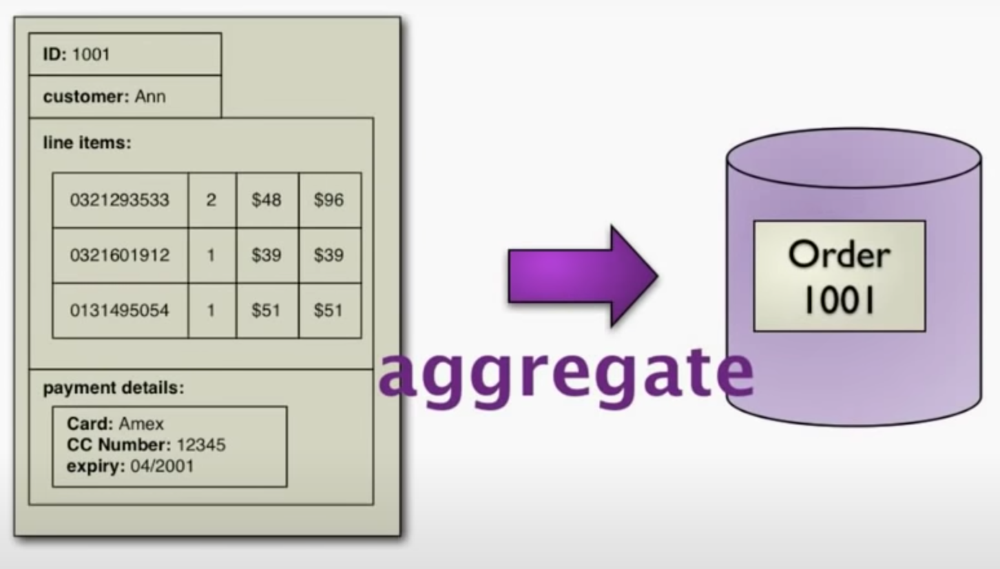
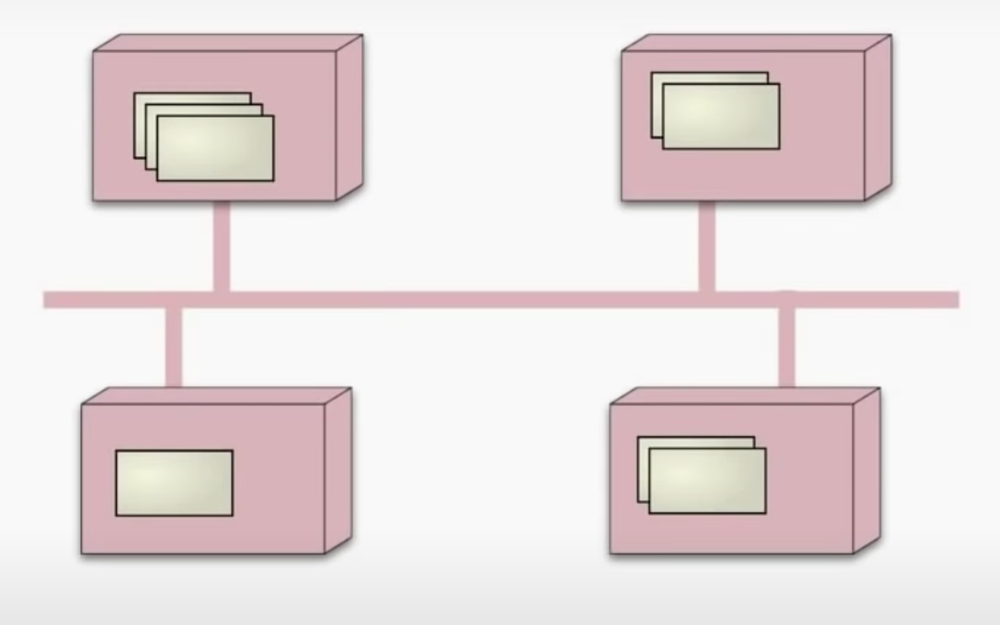
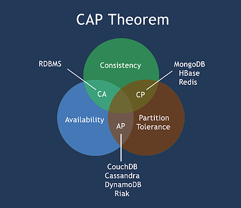
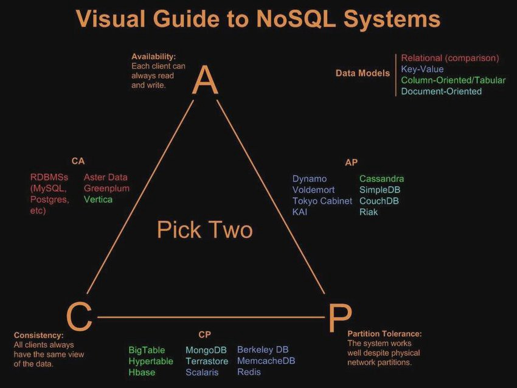
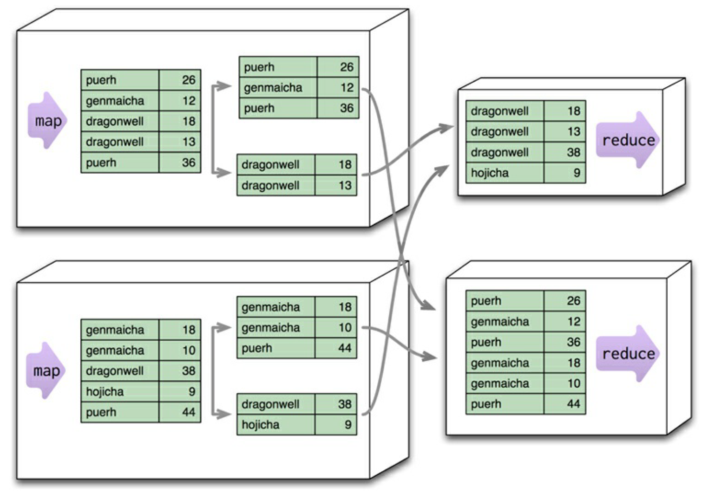

# NoSQL: Características

Nesta seção são apresentadas as principais características dos bancos de dados NoSQL. Tais características conferem a estes bancos de dados os diferenciais que os tornaram a opção preferencial para armazenamento e recuperação de dados com alto desempenho.

## Agregados

Agregado é um termo com origem no campo de Projeto Dirigido por Domínio (*Domain-Driven Design*) \[[2](#Evans-2004-BOOK)\], remetendo a uma coleção de objetos relacionados tratados como uma unidade, um bloco único de objetos. Em particular, é uma unidade para manipulação de dados e gerenciamento de consistência.

O modelo relacional divide dados em tuplas, ou linhas em um estrutura tabular limitada que não permite aninhamento de tuplas ou mesmo a colocação de uma lista de valores ou tuplas dentro de outra. Já a orientação por agregados adota uma abordagem diferente, reconhecendo que muitas vezes os dados precisam ser tratados como unidades que possuem uma estrutura mais complexa do que um conjunto de tuplas. Ao se flexibilizar as propriedades ACID (Atomicidade, Consistência, Isolamento e Durabilidade) mantendo-as apenas intra-agregados, os agregados podem ser usados como a unidade mínima, indivisível na hora de se fazer fragmentação (*sharding*) ou replicação de dados, ou seja, cada *shard* ou nó replicador contém agregados inteiros, ou ainda cada agregado fica armazenado em um, e apenas um nó.

## Liberdade de Esquema

Antes mesmo de armazenar dados em um banco de dados relacional é necessário definir um esquema explicitamente, especificando quais tabelas e colunas existem e quais tipos de dados cada coluna pode armazenar. Em bancos de dados NoSQL, o armazenamento de dados é muito mais casual, não necessitando de um esquema explicitamente predeterminado. Em um banco de dados NoSQL chave-valor por exemplo, é possível armazenar quaisquer dados binários diferentes desde que estejam associados a uma chave. O mesmo princípio ocorre com bancos de dados NoSQL orientados a coluna, documento ou grafo.

A ausência de esquema provê mais liberdade e flexibilidade sem a necessidade de se especificar com antecedência a estrutura do que se quer armazenar, o que pode ser difícil em algumas ocasiões. Sem uma associação de esquema é possível armazenar o que se precisa, podendo alterar facilmente o armazenamento de dados à medida que se aprende mais sobre o projeto. Também é possível facilmente adicionar coisas novas à medida em que são descobertas. Além disso, ao descobrir que não se precisa mais de algumas coisas, pode-se simplesmente parar de armazená-las, sem se preocupar com a perda de dados antigos como faria se excluísse colunas em um esquema relacional.

## Distribuição de Dados

Uma característica marcante e que desperta grande interesse em bancos de dados NoSQL é sua capacidade de distribuir dados em um grande *cluster* computacional. Ao se aumentar o volume de dados armazenados torna-se mais difícil e caro aumentar a escala de armazenamento a partir da atualização ou compra de um servidor com maior capacidade de armazenamento (escalonamento vertical). Uma opção mais atraente passa a ser o escalonamento horizontal, executando o banco de dados de forma distribuída em um *cluster* de servidores.

A orientação por agregados é adequada para obtenção de escalabilidade uma vez que agregados são unidades naturais a serem usadas para distribuição. Dependendo do modelo de distribuição, pode-se obter a capacidade de lidar com grandes quantidades de dados, a capacidade de processar um maior tráfego de leitura ou gravação, ou mesmo maior disponibilidade em caso de lentidão ou problemas com o tráfego de rede. No entanto, tais benefícios têm um custo. Executar sobre um *cluster* representa complexidade e não é útil a menos que
os benefícios sejam atraentes.

De forma geral, existem duas estratégias para a distribuição de dados: replicação (*replication*) e fragmentação (*sharding*). A replicação copia o mesmo conjunto de dados em vários nós. A fragmentação distribui dados diferentes em nós diferentes. Replicação e fragmentação são técnicas ortogonais, podendo-se usar uma ou ambas. A replicação pode ser implementada de duas formas, numa arquitetura mestre-escravo ou ponto-a-ponto. Basicamente, do mais simples para o mais complexo pode-se ter uma arquitetura de servidor único (*single-server*), replicação mestre-escravo (*master-slave*), fragmentação (*sharding*), replicação ponto-a-ponto (*peer-to-peer*) e fragmentação com replicação.

## Relaxamento ACID

A obtenção de consistência de dados pressupõe o sacrifício de outras características importantes, especialmente as relacionadas ao desempenho. Em bancos de dados relacionais de servidor único a principal ferramenta para garantir a consistência é o mecanismo transacional, que garante, além de consistência, atomicidade, isolamento e durabilidade (propriedades ACID). Mas mesmo este mecanismo permite o relaxamento dos níveis de isolamento em prol de maior desempenho.

O teorema CAP é geralmente usado como justificativa para a necessidade de relaxamento da consistência. A afirmação básica do teorema CAP é que, dadas três propriedades, consistência (*Consistency*), disponibilidade (*Availability*) e tolerância de partição (*Partition tolerance*), um sistema não pode obter essas três propriedades simultaneamente. Na figura abaixo observa-se que enquanto os sistemas gerenciadores de banco de dados relacionais garantem consistência e disponibilidade, não garantem tolerância de partição, enquanto alguns sistemas de banco de dados NoSQL, como *HBase*, *MongoDB* e *Redis* garantem consistência e tolerância de partição, mas não garantem disponibilidade.

Por consistência entenda-se a capacidade do sistema evitar que erros ocorram, em particular erros de leitura e escrita acidental de dados indesejados. Mais especificamente, todos os nós de um *cluster* computacional enxergam o mesmo dado no mesmo instante de tempo. Por disponibilidade entenda-se a capacidade de um nó ativo de um *cluster* computacional ler e gravar dados. Mais especificamente, requisições válidas de dados são sempre respondidas por um nó. E por tolerância de partição entenda-se a capacidade do *cluster* computacional se manter ativo em caso de falhas de comunicação. Mais especificamente, falhas de comunicação não impedem a troca de mensagens entre os nós.

## Versionamento de Dados

Muitos críticos dos bancos de dados NoSQL concentram suas críticas à falta de suporte a transações. Certamente mecanismos transacionais são ferramentas úteis no suporte à consistência. Em contrapartida, uma razão pela qual muitos defensores dos bancos de dados NoSQL negligenciam mecanismos transacionais é que a orientação a agregados suporta atualizações intra-agregados, sendo que estes são projetados para que seus dados formem uma unidade natural de atualização.

Mas mesmo numa arquitetura de servidor único estampas (rótulos ou marcadores) de versão (*version stamp*) são úteis para manter a consistência de dados. A ideia é associar estampas de versão aos dados, sendo que a cada vez que um dado mudar uma nova estampa de versão é associada a ele. Dessa forma, ao realizar uma escrita é possível verificar se houveram mudanças de versão desde a última leitura que possa gerar inconsistência na operação.
Em uma arquitetura distribuída, com múltiplos nós de armazenamento e processamento, o versionamento de dados se torna ainda mais importante. Cada arquitetura de distribuição demanda técnicas distintas de versionamento de dados. Por exemplo, numa arquitetura mestre-escravo uma forma simples de versionamento é por contador, em que a cada vez que um nó atualiza um dado ele incrementa um contador e atribui seu valor à estampa de versão associada ao dado.

## Processamento Distribuído

Em bancos de dados centralizados geralmente existem duas maneiras de se executar a lógica de processamento, no próprio servidor de banco de dados ou em uma máquina cliente. A execução em uma máquina cliente oferece
mais flexibilidade na escolha do ambiente de programação, tornando mais fácil a criação dos programas, mas a um custo de recuperar um grande volume de dados do servidor para processamento. Em contrapartida, a execução no servidor impõe uma carga maior de processamento ao servidor e traz menor conveniência na programação, mas elimina a necessidade de transferência de grandes volumes de dados que encontram-se armazenados no próprio servidor.

A adoção de *cluster* computacional não somente altera as regras para armazenamento de dados, mas também as regras de processamento, a começar pelo fato de se ter muitas máquinas para espalhar o
processamento. No entanto, é necessário tentar reduzir o volume de dados transferidos pela rede, realizando o máximo de processamento possível no próprio nó de armazenamento.

O padrão *map-reduce* é uma maneira de organizar
processamento de forma a tirar proveito de várias máquinas em *cluster*. Uma implementação de código aberto amplamente usada faz parte do projeto *Hadoop*. De forma sucinta, o primeiro estágio de processamento utilizando o padrão é o *map*, uma função cuja entrada é um único agregado e cuja saída é um conjunto de pares chave-valor. Cada aplicação da função é independente uma das outras, o que permite que cada uma delas seja  paralelizável, resultando em alto desempenho oriundo dos benefícios da localidade de acesso aos dados. Diversos nós podem executar funções *map* gerando saídas simples que são combinadas no estágio *reduce*.

No exemplo acima, diversas aplicações de função *map* são executadas em nós diferentes gerando pares chave-valor que são combinados na sequência por funções *reduce* que ao fim do processamento geram um único conjunto de dados combinados.

## Refer&ecirc;ncias

\[[1][1]\] Pramod J. Sadalage, Martin Fowler. NoSQL Distilled: A Brief Guide to the Emerging World of Polyglot Persistence. 1ed. Pearson, 2013.

\[[2][2]\] Eric Evans. Domain-Driven Design. Addison-Wesley. 2004.

\[[3][3]\] Martin Fowler. Introduction to NoSQL: NoSQL and consistency, 2012.

\[[4][4]\] Martin Fowler. Introduction to NoSQL: CAP theorem, 2012.

[1]: https://doi.org/10.5555/2381014
[2]: https://www.amazon.com/Domain-Driven-Design-Tackling-Complexity-Software/dp/0321125215
[3]: https://www.youtube.com/watch?v=qI_g07C_Q5I&t=1547s
[4]: https://www.youtube.com/watch?v=qI_g07C_Q5I&t=2428s
