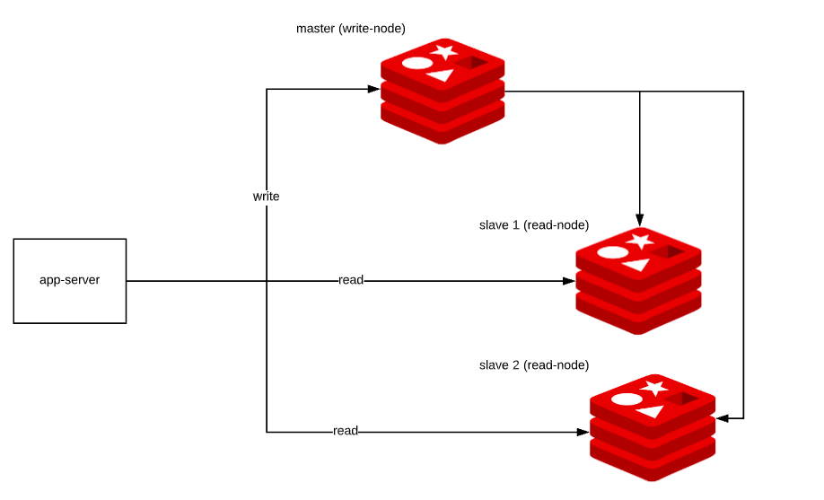
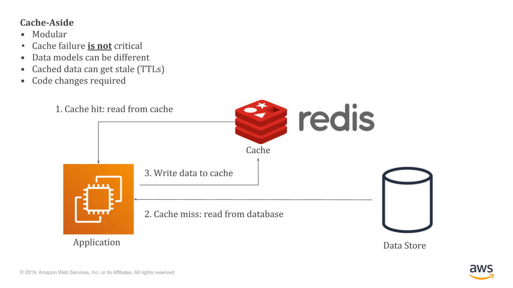

# NoSQL: Redis

[Redis](https://redis.io/) é um sistema de banco de dados NoSQL **chave-valor** de código aberto que provê uma solução de armazenamento de dados em memória (*in-memory*) com diferentes níveis de persistência, desde nenhuma (*no persistence*) até persistência em arquivos de *logs* a cada escrita de dados (*AOF - Append Only File*). Se trata de uma solução distribuída, resiliente e de alto desempenho que privilegia aspectos AP (*Availability and Partition Tolerance*), de disponibilidade e tolerância de partição (ver [Teorema CAP](https://en.wikipedia.org/wiki/CAP_theorem)).

Os nós Redis encontram-se configurados numa arquitetura mestre-escravo, o que confere à solução baixa latência e alto desempenho, especialmente em modo de comunicação assíncrona. A solução Redis garante alta disponibilidade a partir do uso do recurso [Redis Sentinel](https://redis.io/topics/sentinel) que provê um mecanismo de monitoramento, notificação e recuperação automática em caso de falhas pela promoção de nós escravos a mestres.

Além disso, o recurso [Redis Cluster](https://redis.io/topics/cluster-tutorial) oferece fragmentação por um mecanismo denominado *hash slot*, em que cada nó está associado e se torna responsável por um conjunto de *hash slots* diferentes. Por exemplo, se um nó contém *hash slots* numerados de *0* a *5500*, outro nó conterá um conjunto de *hash slots* distintos, como *5501* a *11000*.

Outro aspecto importante da solução Redis é a implementação do conceito de [transação](https://redis.io/topics/transactions) que possibilita a execução de um grupo de operações de leitura e escrita como um único bloco lógico de execução, o que, tal como em sistemas de bancos de dados relacionais, demanda mecanismos de controle de concorrência de transação.

Os recursos supra descritos, bem como uma infinidade de outros recursos disponíveis na solução Redis, fazem dela uma solução efetiva para *cache*, *message broker* e armazenamento transitório de grandes volumes de dados agregados.

# Refer&ecirc;ncias

\[[1][1]\] Pramod J. Sadalage, Martin Fowler. NoSQL Distilled: A Brief Guide to the Emerging World of Polyglot Persistence. 1ed. Pearson, 2013.

\[[2][2]\] Martin Fowler. Introduction to NoSQL: Key-value data model, 2012.

[1]: https://doi.org/10.5555/2381014
[2]: https://www.youtube.com/watch?v=qI_g07C_Q5I&t=604s
