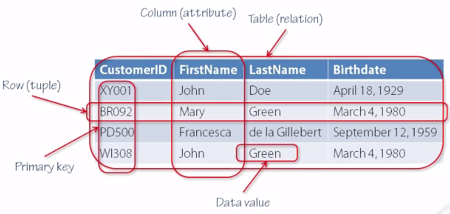
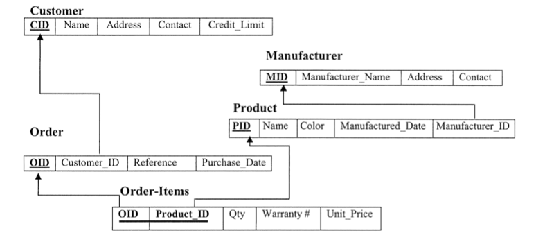
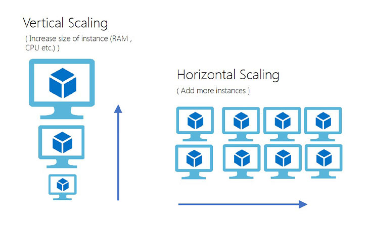
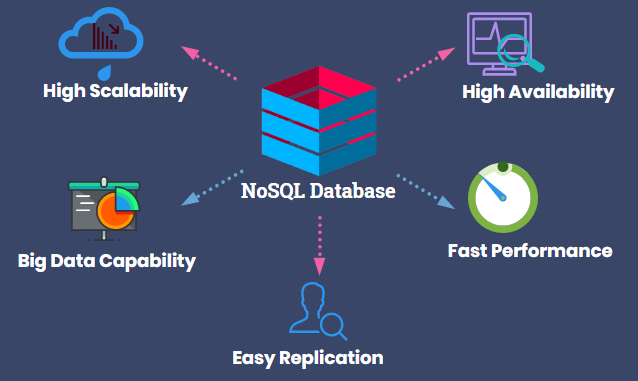

# NoSQL: Modelo Tabular

Bancos de dados relacionais utilizam um modelo de dados baseado numa estrutura tabular simples composta por colunas e linhas para organização dos dados no banco de dados. Formalmente, esse modelo de dados é um modelo representativo denominado modelo relacional que se baseia no princípio de que todos os dados devem ser armazenados em tabelas (relações), na lógica de predicados e na teoria dos conjuntos. Historicamente, foi o primeiro modelo de dados descrito teoricamente \[[1](#Codd-1970-CACM)\].

Sistemas de banco de dados relacionais se tornaram muito populares a partir da década de 1980 e ainda são amplamente utilizados devido à sua robustez e  confiabilidade para armazenamento persistente de grandes quantidades de dados, provendo um mecanismo simples para integração de aplicações a partir da especificação de esquemas rígidos e centralização de dados. Além disso, o modelo de dados relacional provê uma algebra simples que torna fácil a compreensão sobre como dados podem ser organizados.

A figura acima ilustra o modelo de dados relacional adotado por sistemas de banco de dados relacionais. Como pode ser observado na figura, uma tabela (ou relação) é composta por linhas (tuplas) e colunas (atributos) e armazena dados (valores) referentes a uma entidade (*customer*). À coluna com valores exclusivos que diferencia cada tupla umas das outras denomina-se chave primária (*primary key*). Uma característica dos bancos de dados relacionais é que o esquema de dados, ou o conjunto de metadados que descrevem quais tabelas, colunas e restrições existem no banco de dados, deve ser definido previamente, sendo que todos os dados devem ser armazenados no banco de dados seguindo esse esquema rígido de armazenamento.

O modelo de dados relacional oferece simplicidade na organização de dados e, em conjunto com uma linguagem de consulta formal igualmente simples ([SQL](https://en.wikipedia.org/wiki/SQL)), fornecem um mecanismo robusto e seguro para armazenamento de dados tabulares simples ou multidimensionais, e de natureza permanente (alta persistência), como no caso de sistemas transacionais ([OLTP](https://en.wikipedia.org/wiki/Online_transaction_processing)) e analíticos ([OLAP](https://en.wikipedia.org/wiki/Online_analytical_processing)). Mas apesar de admitir armazenamento persistente, integrado, com controle de concorrência de transações e de redundância de dados que lhes confere propriedades de consistência e disponibilidade, problemas de impedância e de escalabilidade se tornaram limitadores para a adoção de sistemas de bancos de dados para aplicações modernas. Tais sistemas se baseiam em escalabilidade vertical, em que o aumento de poder computacional se dá pela atualização de hardware computacional. Essa escalabilidade vertical é limitada, cara e complexa, comprometendo o desempenho do sistema para armazenamento e processamento de volumes massivos de dados.

Nesse contexto, modelos de dados que proporcionem flexibilidade na definição de esquemas de dados, alto desempenho no armazenamento e processamento de volumes massivos de dados com tolerância a falhas e baixa impedância se tornaram fundamentais. Dessa forma, no final da década de 2000 diversas empresas de alta tecnologia, tais como Amazon, Facebook e Google, começaram a desenvolver diferentes modelos de dados e soluções de armazenamento baseados nesses modelos capazes de prover escalabilidade horizontal com baixa impedância, alta disponibilidade e tolerância a falha para armazenamento de grandes volumes de dados (*Big Data*).

# Refer&ecirc;ncias

\[[1][1]\] Edgar Frank Codd. A relational model of data for large shared data banks. Communications of the ACM. 13(6):377–387. 1970.

\[[2][2]\] Ramez Elmasri, Shamkant B. Navathe. Fundamentals of database systems. 7ed. Pearson, 2016.

\[[3][3]\] Pramod J. Sadalage, Martin Fowler. NoSQL Distilled: A Brief Guide to the Emerging World of Polyglot Persistence. 1ed. Pearson, 2013.

[1]: https://doi.org/10.1145%2F362384.362685
[2]: https://www.pearson.com/us/higher-education/program/Elmasri-Fundamentals-of-Database-Systems-7th-Edition/PGM189052.html
[3]: https://doi.org/10.5555/2381014
