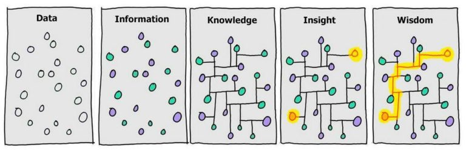
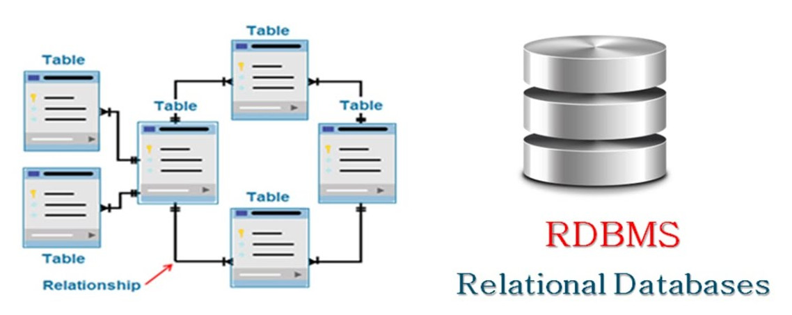
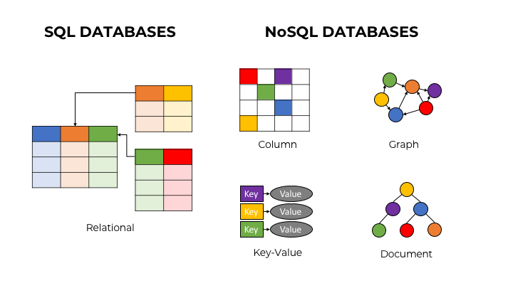

# NoSQL: Terminologia

Nesta seção são apresentados os principais termos e respectivos conceitos relacionados ao tópico de bancos de dados NoSQL. Tais elementos fornecem base teórica necessária para a compreensão de conteúdo relevante apresentada no decorrer do curso.

**Dado** é um conjunto de símbolos, sinais ou códigos que podem ou não ser decifráveis, enquanto **informação** refere-se a uma ideia, um conceito com significado. Já **conhecimento** refere-se a uma cadeia de correlações entre ideias, enquanto **sabedoria** é a capacidade de encadeamento e utilização de conhecimento relevante para solucionar problemas. Enquanto **dado** é concreto e objetivo, podendo ser percebido sensorialmente, **informação**, **conhecimento** e **sabedoria** são abstratos e subjetivos, pressupondo a existência de uma mente, natural ou artificial. Dessa forma, apesar dos conceitos estarem relacionados, ou que significa que não existiria **informação** sem **dado**, ou **conhecimento** sem **informação** por exemplo, fisicamente o que existe e pode ser mensurado e processado são **dados**. Toda **informação**, **conhecimento** e **sabedoria** só existem num plano metafísico mental.

Um **banco de dados** é um conjunto organizado (estruturado) de dados, enquanto um **modelo de dados** refere-se a um arcabouço conceitual que descreve a forma como os dados são organizados e tratados. Por exemplo, no modelo de dados relacional os dados são organizados de forma tabular com cada tabela representando uma entidade do mundo real, suas colunas representando propriedades da entidade e suas linhas representando instâncias da entidade. Um **sistema gerenciador de banco de dados** é o conjunto de softwares e aplicativos utilizados para manter um banco de dados, enquanto um **esquema de dados** refere-se à coleção de metadadados construídos *a priori* para descrever um banco de dados, contendo suas entidades, relacionamentos e restrições. Por exemplo, no modelo de dados relacional uma tabela representando uma entidade  pode ser reconhecida pelo rótulo *Empresa* e ser constituída pelas colunas *Nome* e *Endereço* com a restrição de armazenarem somente cadeias de caracteres.

Um **sistema de banco de dados** é constituído por bancos de dados, um modelo de dados e um sistema gerenciador de banco de dados. **Linguagens de consulta** são linguagens formais utilizadas por usuários e aplicações de sistemas de banco de dados para especificar consultas a serem submetidas ao sistema. **SQL**, do inglês, *Structured Query Language*, ou Linguagem de Consulta Estruturada, é uma linguagem de consulta padrão de sistemas de bancos de dados que adotam o modelo de dados relacional, também conhecidos como **sistemas de banco de dados relacionais**.

Um **sistema de banco de dados NoSQL** refere-se a toda solução de armazenamento de dados de baixa impedância e alto desempenho que não faz uso do modelo relacional para armazenamento de volumes massivos de dados. Muitas dessas soluções operam em *cluster* computacional e sem um esquema de dados predefinido, conferindo-lhes alta disponibilidade e tolerância a falhas. **Big Data** é um termo genérico utilizado para descrever volumes massivos de dados multivariados e de alta dimensionalidade, comumente gerados em tempo real com velocidade de crescimento exponencial.

# Refer&ecirc;ncias

\[[1][1]\] Edgar Frank Codd. A relational model of data for large shared data banks. Communications of the ACM. 13(6):377–387. 1970.

\[[2][2]\] Ramez Elmasri, Shamkant B. Navathe. Fundamentals of database systems. 7ed. Pearson, 2016.

\[[3][3]\] Pramod J. Sadalage, Martin Fowler. NoSQL Distilled: A Brief Guide to the Emerging World of Polyglot Persistence. 1ed. Pearson, 2013.

\[[4][4]\] Martin Fowler. Introduction to NoSQL: Definition of NoSQL, 2012.

[1]: https://doi.org/10.1145%2F362384.362685
[2]: https://www.pearson.com/us/higher-education/program/Elmasri-Fundamentals-of-Database-Systems-7th-Edition/PGM189052.html
[3]: https://doi.org/10.5555/2381014
[4]: https://www.youtube.com/watch?v=qI_g07C_Q5I&t=471s
