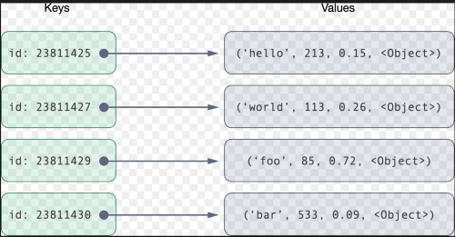
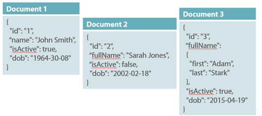
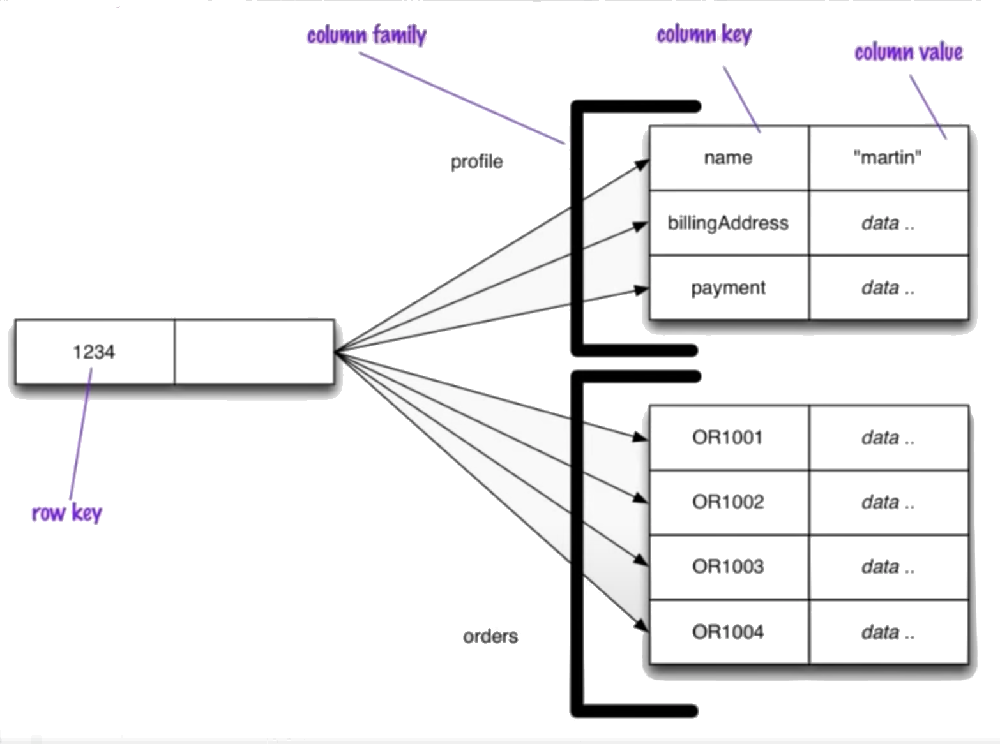
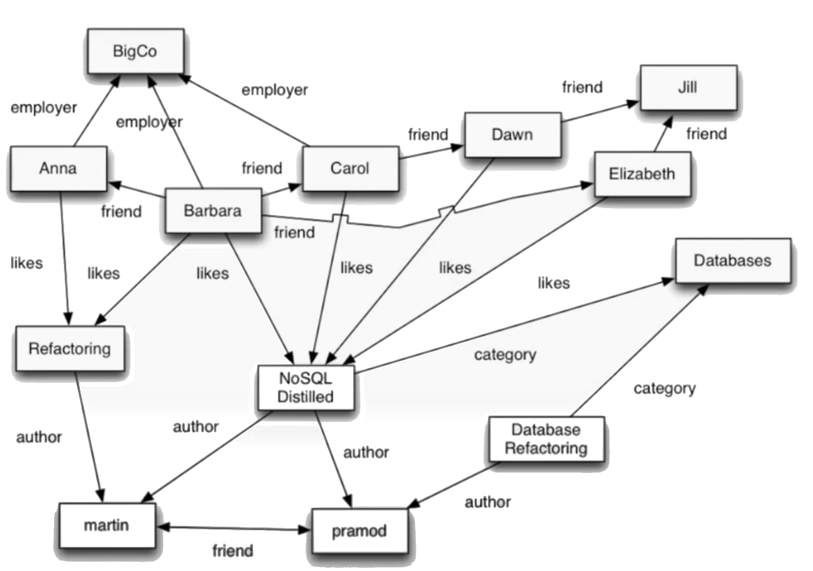

# NoSQL: Tipos

Nesta seção são apresentados os principais tipos de bancos de dados NoSQL, incluindo os bancos de dados chave-valor (**key-value store**), orientados a documento (**document store**), orientados a coluna (**wide column store**) e orientados a grafo (**graph store**).

## Chave-Valor (*Key-Value*)

Bancos de dados chave-valor são geralmente implementados usando tabelas hash e são muito eficientes quando o acesso aos dados (valores) são efetuados exclusivamente por uma chave (primária). Os valores associados a cada chave podem assumir qualquer valor blob (*binary object*). No exemplo abaixo, o valor associado à chave *2398240* contém uma string de valor *Lorem ipsum dolor sit amet*, enquanto o valor associado à chave *2398242* contém o valor numérico *42*.

Alguns dos bancos de dados NoSQL do tipo chave-valor mais populares atualmente são [BerkeleyDB](http://www.oracle.com/us/products/database/berkeley-db), [DynamoDB](http://aws.amazon.com/dynamodb), [HamsterDB](http://hamsterdb.com/), [MemcachedDB](http://memcached.org/), [Redis](http://redis.io/), [Riak](http://wiki.basho.com/Riak.html), e [Voldemort](http://project-voldemort.com/), uma versão de código aberto do DynamoDB.

## Documento (*Document*)

Este tipo de banco de dados armazena e recupera documentos de diferentes formatos, tais como XML, JSON, BSON, dentre outros. Esses documentos são organizados em uma estrutura hierárquica em árvore, podendo armazenar dados como mapas, coleções e valores escalares. Os documentos armazenados são geralmente semelhantes entre si, mas não necessariamente precisam ser iguais. No exemplo abaixo, o documento *Document 3* armazena os valores escalares *id*, *isActive* e *dob* e o valor *fullName* composto dos valores escalares *first* e *last*. Alguns dos bancos de dados NoSQL do tipo documento mais populares são [CouchDB](http://couchdb.apache.org/), [MongoDB](http://www.mongodb.org/), [OrientDB](http://www.orientdb.org/), [RavenDB](http://ravendb.net/) e [Terrastore](http://code.google.com/p/terrastore).

## Coluna (*Wide-Column* / *Column-Family*)

Bancos de dados de famílias de colunas armazenam dados em famílias de colunas como linhas que possuem muitas colunas associadas com uma chave de linha. Famílias de colunas são grupos de dados relacionados que são frequentemente acessados conjuntamente. No exemplo apresentado abaixo o valor de chave *1234* está associado a duas famílias de colunas, *profile* e *orders*. A família de colunas *profile* possui um conjunto de pares chave-valor, composto pelas chaves *name*, *billingAddress* e *payment* e seus respectivos valores. Alguns dos bancos de dados NoSQL do tipo documento mais populares são [Cassandra](http://cassandra.apache.org/), [DynamoDB](http://aws.amazon.com/dynamodb), [HBase](http://hbase.apache.org/) e [Hypertable](http://hypertable.org/).

## Grafo (*Graph*)

Bancos de dados orientados a grafo permitem armazenar entidades (nós) e relacionamentos (arestas) entre essas entidades, bem como suas propriedades. Arestas podem ser direcionais e tipificadas. No exemplo abaixo, os nós *BigCo* e *Anna* estão relacionadas pela aresta *employer*. A direção da aresta representa que o nó *Anna* é empregado do nó *BigCo*, mas o nó *BigCo* não é empregado do nó *Anna*.
Alguns dos bancos de dados orientados a grafos mais populares são [FlockDB](https://github.com/twitter/flockdb/), [Infinite Graph](http://www.infinitegraph.com/), [Neo4J](http://neo4j.org/) e [OrientDB](http://www.orientdb.org/).

# Refer&ecirc;ncias

\[[1][1]\] Pramod J. Sadalage, Martin Fowler. NoSQL Distilled: A Brief Guide to the Emerging World of Polyglot Persistence. 1ed. Pearson, 2013.

\[[2][2]\] Martin Fowler. Introduction to NoSQL: Key-value data model, 2012.

\[[3][3]\] Martin Fowler. Introduction to NoSQL: Document data model, 2012.

\[[4][4]\] Martin Fowler. Introduction to NoSQL: Column-family data model, 2012.

\[[5][5]\] Martin Fowler. Introduction to NoSQL: Graph data model, 2012.

[1]: https://doi.org/10.5555/2381014
[2]: https://www.youtube.com/watch?v=qI_g07C_Q5I&t=604s
[3]: https://www.youtube.com/watch?v=qI_g07C_Q5I&t=637s
[4]: https://www.youtube.com/watch?v=qI_g07C_Q5I&t=1056s
[5]: https://www.youtube.com/watch?v=qI_g07C_Q5I&t=1220s
